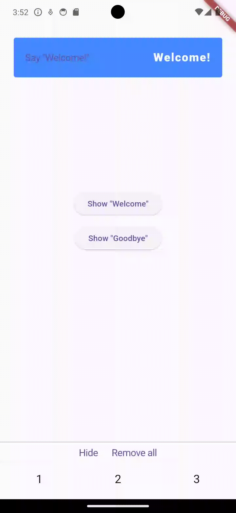
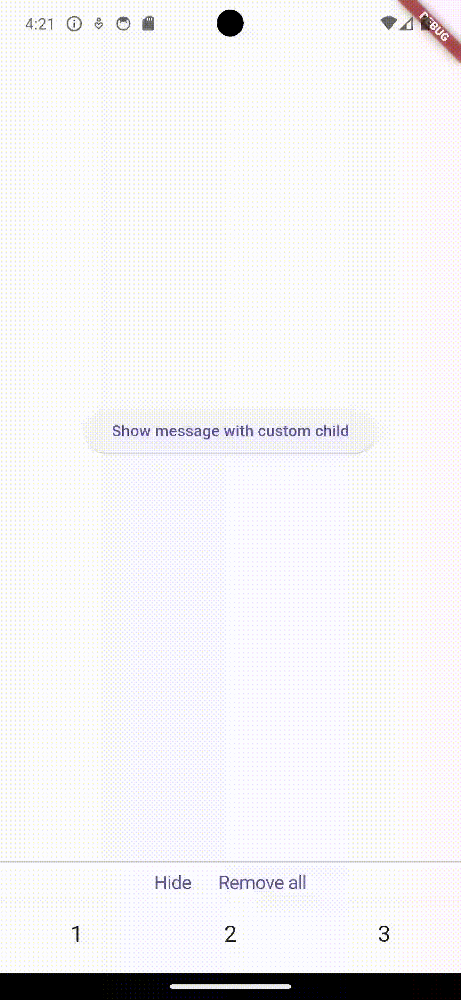

# Lil Snack

[](https://pub.dev/packages/lil_snack)
[](https://pub.dev/packages/lil_snack/score)

Package for displaying messages to the user. 

You can set basic message styles and easily show beautiful alerts to the user. 

You can also create your own unique alerts.

<div align="center">


</div>
<div align="center">

</div>

## Getting started

- Add to app theme ```LilSnackTheme``` as extension. All fields must not be null, except ```boxShadow``` 
and ```borderRadius```.

```
ThemeData.light().copyWith(
          extensions: [
            LilSnackTheme(
              successIconColor: Colors.white,
              warningIconColor: Colors.white,
              errorIconColor: Colors.white,
              notificationIconColor: Colors.black,
              successBackgroundColor: Colors.green,
              warningBackgroundColor: Colors.deepOrange.shade300,
              errorBackgroundColor: Colors.red,
              notificationBackgroundColor: Colors.grey.shade300,
              borderRadius: BorderRadius.circular(16),
              boxShadow: null,
              iconSize: 24,
              successTextStyle: const TextStyle(
                fontSize: 16,
                color: Colors.white,
                fontWeight: FontWeight.w600,
              ),
              warningTextStyle: const TextStyle(
                fontSize: 16,
                color: Colors.white,
                fontWeight: FontWeight.w600,
              ),
              errorTextStyle: const TextStyle(
                fontSize: 16,
                color: Colors.white,
                fontWeight: FontWeight.w600,
              ),
              notificationTextStyle: const TextStyle(
                fontSize: 16,
                color: Colors.black,
                fontWeight: FontWeight.w600,
              ),
            ),
          ],
        );
```

- Wrap widget tree with ```LilSnackMessenger```.

```
     LilSnackMessenger(child: WidgetTree()),
```

- To use ```LilSnackMessenger```, access its state through the context.

```
    LilSnackMessenger.of(context)
    LilSnackMessenger.maybeOf(context)
```

## Usage

- To display a default message customized by theme.

```dart
  /// Adds a success message to the queue.
  void _showSuccess(BuildContext context) => LilSnackMessenger.of(context).show(
        const LilSnack(
          type: LilSnackType.success,
          text: 'Success message.',
        ),
      );
```

- To hide the currently displayed message.

```dart
  /// Hides current message.
  void _hide() => LilSnackMessenger.of(context).hide();
```

- To remove all messages.

```dart
  /// Removes all messages.
  void _removeAll() => LilSnackMessenger.of(context).removeAll();
```

- To show custom message.

```dart
  // These two messages will be considered the same if you remove the keys
  // from the widgets being passed.
  //
  // Therefore, set the keys for the passed widgets.

  /// Adds a welcome message to the queue.
  void _showWelcome(BuildContext context) => LilSnackMessenger.of(context).show(
        CustomLilSnack(
          leading: CupertinoButton(
            key: const Key('welcome-button'),
            onPressed: () => debugPrint("Welcome!"),
            minSize: 20,
            padding: EdgeInsets.zero,
            child: const Text('Say "Welcome!"'),
          ),
          content: const Text(
            key: Key('welcome-text'),
            'Welcome!',
            maxLines: 1,
            textAlign: TextAlign.right,
            overflow: TextOverflow.fade,
            style: TextStyle(
              fontSize: 20,
              letterSpacing: 1.4,
              color: Colors.white,
              fontWeight: FontWeight.w900,
            ),
          ),
          decoration: BoxDecoration(
            color: Colors.blueAccent.shade200,
            borderRadius: BorderRadius.circular(4),
          ),
          dismissDirection: DismissDirection.startToEnd,
          // Custom animation.
          animationBuilder: (context, lilSnack, animation) => SlideTransition(
            position: Tween<Offset>(
              begin: const Offset(1, 0),
              end: Offset.zero,
            ).animate(animation),
            child: lilSnack,
          ),
        ),
      );

  /// Adds a goodbye message to the queue.
  void _showGoodbye(BuildContext context) => LilSnackMessenger.of(context).show(
        CustomLilSnack(
          leading: CupertinoButton(
            key: const Key('goodbye-button'),
            onPressed: () => debugPrint("Goodbye!"),
            minSize: 20,
            padding: EdgeInsets.zero,
            child: const Text('Say "Goodbye!"'),
          ),
          content: const Text(
            key: Key('goodbye-text'),
            'Goodbye!',
            maxLines: 1,
            textAlign: TextAlign.right,
            overflow: TextOverflow.fade,
            style: TextStyle(
              fontSize: 20,
              letterSpacing: 1.4,
              color: Colors.white,
              fontWeight: FontWeight.w900,
            ),
          ),
          decoration: BoxDecoration(
            color: Colors.blueAccent.shade200,
            borderRadius: BorderRadius.circular(4),
          ),
          dismissDirection: DismissDirection.endToStart,
          // Custom animation.
          animationBuilder: (context, lilSnack, animation) => SlideTransition(
            position: Tween<Offset>(
              begin: const Offset(-1, 0),
              end: Offset.zero,
            ).animate(animation),
            child: lilSnack,
          ),
        ),
      );
```

- To show a custom child message.

```dart
  /// Adds a custom child message to the queue.
  void _showCustomChild(BuildContext context) =>
      LilSnackMessenger.of(context).show(
        CustomChildLilSnack(
          child: DecoratedBox(
            key: const Key('red-box'),
            decoration: const BoxDecoration(
              color: Colors.red,
              borderRadius: BorderRadius.only(
                bottomLeft: Radius.circular(24),
                bottomRight: Radius.circular(24),
              ),
            ),
            child: SizedBox.fromSize(
              size: const Size.fromHeight(150),
            ),
          ),
          // Custom animation.
          animationBuilder: (context, lilSnack, animation) => SlideTransition(
            position: Tween<Offset>(
              begin: const Offset(0, -1),
              end: Offset.zero,
            ).animate(animation),
            child: lilSnack,
          ),
        ),
      );
```

## Additional information

For a better understanding of how to use the package, see the example app.
